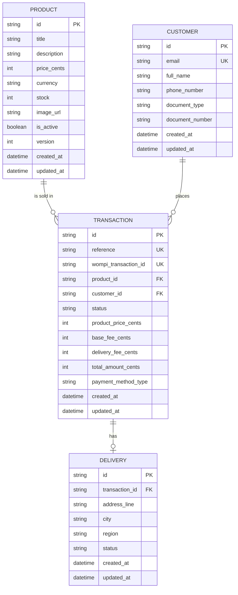

<p align="center">
  <a href="http://nestjs.com/" target="blank"></a>
</p>

[circleci-image]: https://img.shields.io/circleci/build/github/nestjs/nest/master?token=abc123def456
[circleci-url]: https://circleci.com/gh/nestjs/nest

  <p align="center">A progressive <a href="http://nodejs.org" target="_blank">Node.js</a> framework for building efficient and scalable server-side applications.</p>
    <p align="center">
<a href="https://www.npmjs.com/~nestjscore" target="_blank"></a>
<a href="https://www.npmjs.com/~nestjscore" target="_blank"></a>
<a href="https://www.npmjs.com/~nestjscore" target="_blank"></a>
<a href="https://circleci.com/gh/nestjs/nest" target="_blank"></a>
<a href="https://discord.gg/G7Qnnhy" target="_blank"></a>
<a href="https://opencollective.com/nest#backer" target="_blank"></a>
<a href="https://opencollective.com/nest#sponsor" target="_blank"></a>
  <a href="https://paypal.me/kamilmysliwiec" target="_blank"></a>
    <a href="https://opencollective.com/nest#sponsor"  target="_blank"></a>
  <a href="https://twitter.com/nestframework" target="_blank"></a>
</p>
  <!--[](https://opencollective.com/nest#backer)
  [](https://opencollective.com/nest#sponsor)-->

## Description

[Nest](https://github.com/nestjs/nest) framework TypeScript starter repository.

## Project setup

```bash
$ pnpm install
```

## Compile and run the project

```bash
# development
$ pnpm run start

# watch mode
$ pnpm run start:dev

# production mode
$ pnpm run start:prod
```

## Run tests

```bash
# unit tests
$ pnpm run test

# e2e tests
$ pnpm run test:e2e

# test coverage
$ pnpm run test:cov
```


 ✓ src/domain/product/product.entity.spec.ts (7 tests) 22ms
 ✓ src/domain/customer/customer.entity.spec.ts (7 tests) 23ms
 ✓ src/domain/transaction/transaction.entity.spec.ts (9 tests) 22ms
 ✓ src/domain/delivery/delivery.entity.spec.ts (7 tests) 24ms
 ✓ src/application/transaction/use-cases/process-transaction.use-case.spec.ts (8 tests) 45ms
 ✓ src/infrastructure/http/app.controller.spec.ts (1 test) 837ms
       ✓ should return "Server is running...."  832ms
 ✓ src/infrastructure/http/controllers/transaction.controller.spec.ts (4 tests) 14ms

 Test Files  7 passed (7)
      Tests  43 passed (43)
   Start at  12:50:53
   Duration  4.61s (transform 1.87s, setup 0ms, import 7.03s, tests 988ms, environment 3ms)

 % Coverage report from v8
-----------------------------------|---------|----------|---------|---------|------------------------------------
File                               | % Stmts | % Branch | % Funcs | % Lines | Uncovered Line #s
-----------------------------------|---------|----------|---------|---------|------------------------------------
All files                          |   90.57 |    85.71 |   97.18 |   90.57 |
 application/transaction/use-cases |   79.24 |    65.62 |     100 |   79.24 |
  process-transaction.use-case.ts  |   79.24 |    65.62 |     100 |   79.24 | 87,107,124,131,144,176,198,205-218
 domain/customer                   |     100 |      100 |     100 |     100 |
  customer.entity.ts               |     100 |      100 |     100 |     100 |
 domain/delivery                   |     100 |      100 |     100 |     100 |
  delivery.entity.ts               |     100 |      100 |     100 |     100 |
 domain/product                    |     100 |      100 |     100 |     100 |
  product.entity.ts                |     100 |      100 |     100 |     100 |
 domain/shared                     |     100 |      100 |     100 |     100 |
  result.ts                        |     100 |      100 |     100 |     100 |
 domain/transaction                |   91.42 |    88.46 |     100 |   91.42 |
  transaction.entity.ts            |   91.42 |    88.46 |     100 |   91.42 | 63,70,114
 infrastructure/http               |     100 |       50 |     100 |     100 |
  app.controller.ts                |     100 |       50 |     100 |     100 | 4
  app.service.ts                   |     100 |      100 |     100 |     100 |
 infrastructure/http/controllers   |   84.61 |    77.77 |     100 |   84.61 |
  transaction.controller.ts        |   84.61 |    77.77 |     100 |   84.61 | 95-97
 infrastructure/http/dtos          |   71.42 |      100 |   33.33 |   71.42 |
  create-transaction.dto.ts        |   71.42 |      100 |   33.33 |   71.42 | 82-97
-----------------------------------|---------|----------|---------|---------|------------------------------------

## Data Model Design

The schema is defined in [prisma/schema.prisma](prisma/schema.prisma) (see also [docs/data-model.md](docs/data-model.md) for the field-level rationale). The Entity-Relationship diagram below reflects its tables and relationships exactly:



- **PRODUCT (1) — (N) TRANSACTION**: a product can appear in many transactions; each transaction snapshots the product's price at purchase time so later price changes never rewrite history.
- **CUSTOMER (1) — (N) TRANSACTION**: a customer can place many transactions and is resolved (or created) by email.
- **TRANSACTION (1) — (0..1) DELIVERY**: a delivery is optional and only ever depends on an existing transaction.

## Unit Tests and Coverage

Unit tests in this project run on [Vitest](https://vitest.dev) (Jest-compatible API: `describe`/`it`/`expect` globals plus `vi.fn()` for mocks) via `pnpm run test`, with coverage collected through `pnpm run test:cov` (`@vitest/coverage-v8`). The suite targets over 80% coverage across the domain entities, application use cases, and infrastructure controllers.

## Deployment

When you're ready to deploy your NestJS application to production, there are some key steps you can take to ensure it runs as efficiently as possible. Check out the [deployment documentation](https://docs.nestjs.com/deployment) for more information.

If you are looking for a cloud-based platform to deploy your NestJS application, check out [Mau](https://mau.nestjs.com), our official platform for deploying NestJS applications on AWS. Mau makes deployment straightforward and fast, requiring just a few simple steps:

```bash
$ pnpm install -g @nestjs/mau
$ mau deploy
```

With Mau, you can deploy your application in just a few clicks, allowing you to focus on building features rather than managing infrastructure.

## Observability

In production applications, observability is essential for understanding how your system behaves, detecting issues early, and maintaining reliable performance.

[NestJS Observe](https://observe.nestjs.com) automatically instruments your NestJS application, giving you deep visibility into your system with minimal setup:

- **Distributed tracing:** Follow requests across services and understand how they flow through your system.
- **Waterfall analysis:** Visualize request execution and identify slow operations, bottlenecks, and unexpected delays.
- **Performance analysis:** Analyze application performance in real time and quickly pinpoint areas that need optimization.
- **Metrics:** Track key application and infrastructure metrics to understand system health and performance trends.
- **Logging:** Centralize and correlate logs with traces and other telemetry to make debugging easier.
- **Error tracking:** Detect errors quickly and investigate their root causes with the surrounding context.
- **SLA monitoring:** Track service-level objectives and identify when your application is approaching or exceeding defined thresholds.
- **Alarms and alerts:** Set up alerts for critical errors, performance degradation, SLA violations, and other anomalies so your team can react quickly.

This project is already instrumented. Create a free account at [observe.nestjs.com](https://observe.nestjs.com), add an application, and paste the generated app key and secret into the `ObserveModule.forRoot()` call in `src/app.module.ts`.

The free plan needs no payment details and covers 300,000 events a month. You can also browse the [live demo](https://www.observe-demo.nestjs.com/dashboard) first - the whole dashboard over a busy service's data, with nothing to install.

## Resources

Check out a few resources that may come in handy when working with NestJS:

- Visit the [NestJS Documentation](https://docs.nestjs.com) to learn more about the framework.
- For questions and support, please visit our [Discord channel](https://discord.gg/G7Qnnhy).
- To dive deeper and get more hands-on experience, check out our official video [courses](https://courses.nestjs.com/).
- Deploy your application to AWS with the help of [NestJS Mau](https://mau.nestjs.com) in just a few clicks.
- Auto-instrument your application with [NestJS Observe](https://observe.nestjs.com). Distributed tracing, metrics, and logging made easy. Error tracking and performance monitoring for your NestJS applications.
- Visualize your application graph and interact with the NestJS application in real-time using [NestJS Devtools](https://devtools.nestjs.com).
- Need help with your project (part-time to full-time)? Check out our official [enterprise support](https://enterprise.nestjs.com).
- To stay in the loop and get updates, follow us on [X](https://x.com/nestframework) and [LinkedIn](https://linkedin.com/company/nestjs).
- Looking for a job, or have a job to offer? Check out our official [Jobs board](https://jobs.nestjs.com).

## Support

Nest is an MIT-licensed open source project. It can grow thanks to the sponsors and support by the amazing backers. If you'd like to join them, please [read more here](https://docs.nestjs.com/support).

## Stay in touch

- Author - [Kamil Myśliwiec](https://twitter.com/kammysliwiec)
- Website - [https://nestjs.com](https://nestjs.com/)
- Twitter - [@nestframework](https://twitter.com/nestframework)

## License

Nest is [MIT licensed](https://github.com/nestjs/nest/blob/master/LICENSE).
